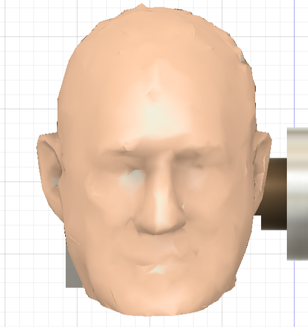

# June 3rd: (Essentially) completed fusion model

I began work on the project, taking inspiration from a couple of exisitng 2 axis gimbals. 
I built a two axis gimbal using the smaller blue stepper motors, as steppers are much much smoother to run than servoes 
I built this in Fusion360 
 

**Time Spent: 7.5hrs(wayy too many design iterations)**

# June 4th: PCB Design

I began work on the PCB - this PCB was supposed to be pretty straightforward w/ the a4988 module but I believe the ULN2003 module is a better choice for us - as it has a neat little point for us to plug in our stepper cable 
I'm also adding another thing - a GPS module which would let me just place this thing anywhere and have it point at Andy sir😝 
@ttf-fog is currently working on the code for this, and it should be ready by tommorrow - we setup his tracking with Traccar, which provides an easy to use api which gives his longitude and latitude (straight up)
**Time Spent: 4.5hrs** 

# June 5th: Updated PCB and 3D Scan

We scanned Andy sir's head and added it to the tip of our pointer thing. 
 
Additionally, I realized that a nano would be pretty much useless as we need to pull the location from an API, so I switched the nano on the PCB to an ESP-32 
Apart from that, I spent a long time looking into using nema-17s or servo motors instead, but I think that would be overkill for our(admittedly silly purposes)
@ttf-fog worked on the code, and will push it soon 

# June 10th

forgot about this and just worked on readme today, along with shipping the project yay!!!  
also @ttf-fog kinda dissapeared on vacaction lmao so this isnt a grp project anymore xD 
**Time Spent: 1hr** 

# June 10th - Pt2

Redesigned the entire PCB for the xiao esp32 
Pretty much nothing else, as the xiao was chosen due to its 10x reliability( recently had a week-long traumatic experience with a esp32 devkit)
