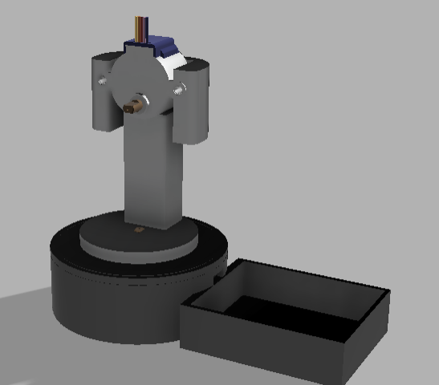

# June 3rd: (Essentially) completed fusion model

I began work on the project, taking inspiration from a couple of exisitng 2 axis gimbals. 
I built a two axis gimbal using the smaller blue stepper motors, as steppers are much much smoother to run than servoes 
I built this in Fusion360 

# June 4th: PCB Design
I began work on the PCB - this PCB was supposed to be pretty straightforward w/ the a4988 module but I believe the ULN2003 module is a better choice for us - as it has a neat little point for us to plug in our stepper cable 
I'm also adding another thing - a GPS module which would let me just place this thing anywhere and have it point at Andy sir😝 
@ttf-fog is currently working on the code for this, and it should be ready by tommorrow - we setup his tracking with Traccar, which provides an easy to use api which gives his longitude and latitude (straight up)