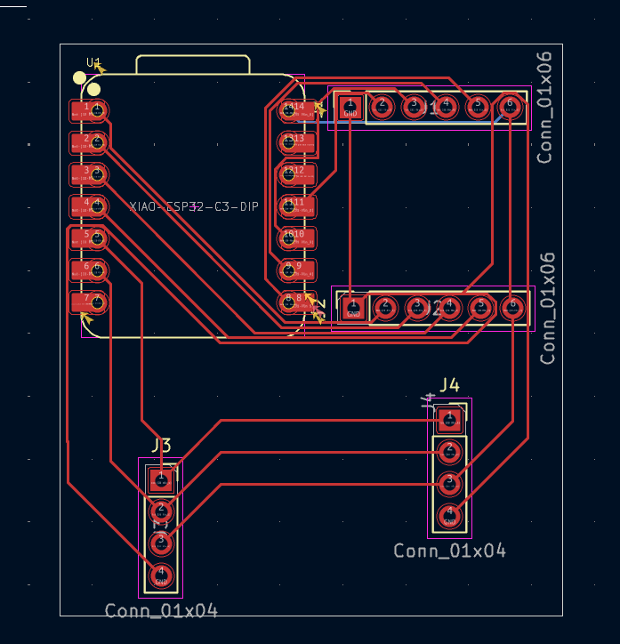

# AndyTracker

**Intro**
This is probably one of the _silliest_ projects I've ever worked on, but also one of the most FUN projects i've ever worked on 

A couple weeks ago, me and @TTF-fog met [Professor Andy Ruina](http://ruina.org/) at a summer program. We then learnt of his _strange_ approach to privacy, which was to ignore it. He wanted to share his location, 24/7 on his website, something which(thanks to us) is now up at https://ruina.org/location.html 

We then had the brilliant(read: stupid) idea of making a device that pointed at him 24/7, leading to this monstrosity

**Design**
This is structured like any 2 axis pan/tilt mechanism, with the blue mini steppers. We did consider using servoes but honestly, we were so bored of using servoes that we decided to use these instead 
We also made a small carrier board for the ESP and the motor drivers, along with an OLED and MPU mounting point 

 
 

**BOM**
| [S.NO](http://s.no/) | ITEM              | QTY | SOURCE                                                                                                                                                                                                                                                                 | Price               | Total  | NOTE                                 |
| -------------------- | ----------------- | --- | ---------------------------------------------------------------------------------------------------------------------------------------------------------------------------------------------------------------------------------------------------------------------- | ------------------- | ------ | ------------------------------------ |
| 1                    | XiaoESP32C3       | 1   | [https://sharvielectronics.com/product/seeed-studio-xiao-esp32c3-tiny-mcu-board-with-wifi-and-ble-battery-charge-supported-module/](https://sharvielectronics.com/product/seeed-studio-xiao-esp32c3-tiny-mcu-board-with-wifi-and-ble-battery-charge-supported-module/) | 7.34(including GST) | 7.34$  |                                      |
| 2                    | ULN2003 Driver    | 2   | [https://www.amazon.in/dp/B09NJLNKHQ?psc=1&ref_=cm_sw_r_cp_ud_ct_57NYJAS8ZS2QP6ZPSX17_2](https://www.amazon.in/dp/B09NJLNKHQ?psc=1&ref_=cm_sw_r_cp_ud_ct_57NYJAS8ZS2QP6ZPSX17_2)                                                                                       | 2.58                | 5.16   |                                      |
| 3                    | 28-BYJ-48 Stepper | 2   | [https://www.amazon.in/dp/B073Q2N6S7?psc=1&ref_=cm_sw_r_cp_ud_ct_57NYJAS8ZS2QP6ZPSX17_3](https://www.amazon.in/dp/B073Q2N6S7?psc=1&ref_=cm_sw_r_cp_ud_ct_57NYJAS8ZS2QP6ZPSX17_3)                                                                                       | 5.61                | 11.22  |                                      |
| 4                    | OLED - 128x64     | 1   | [https://www.amazon.in/dp/B07Q7VZ716?psc=1&ref_=cm_sw_r_cp_ud_ct_57NYJAS8ZS2QP6ZPSX17_4](https://www.amazon.in/dp/B07Q7VZ716?psc=1&ref_=cm_sw_r_cp_ud_ct_57NYJAS8ZS2QP6ZPSX17_4)                                                                                       | 4.38                | 4.38   |                                      |
| 5                    | IMU               | 1   | [https://www.amazon.in/dp/B0DWXXCPS9?psc=1&ref_=cm_sw_r_cp_ud_ct_57NYJAS8ZS2QP6ZPSX17_5](https://www.amazon.in/dp/B0DWXXCPS9?psc=1&ref_=cm_sw_r_cp_ud_ct_57NYJAS8ZS2QP6ZPSX17_5)                                                                                       | 3.54                | 3.54   |                                      |
| 6                    | PCB               | 1   | [https://www.seeedstudio.com/fusion_pcb.html](https://www.seeedstudio.com/fusion_pcb.html)                                                                                                                                                                             | 20                  | 20     | Roughly what it cost for my last pcb |
|                      |                   |     |                                                                                                                                                                                                                                                                        |                     | 51.64$ |                                      |
